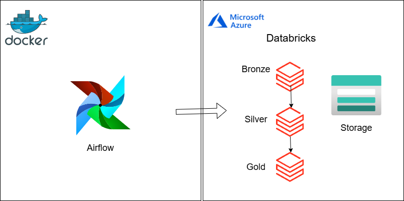

# 🚀 Data Pipeline with Airflow + Databricks + Azure Storage

The proposed architecture presents a modern solution for data pipeline orchestration using leading market technologies:

- **Orchestration**: Apache Airflow for workflow management
- **Processing**: Azure Databricks for layered transformations (Bronze, Silver, Gold)
- **Storage**: Azure Storage (Data Lake) + Delta Lake
- **Governance**: Unity Catalog for Silver and Gold layers

<p align="center">
  
</p>

---

## About the Architecture

This project's architecture uses **Apache Airflow**, installed via **Astronomer** and running in **Docker**, to orchestrate notebook execution in **Azure Databricks**. These notebooks are responsible for processing data in three layers:

### 🔸 Bronze Layer
- Ingestion of raw data from API: [https://api.openbrewerydb.org](https://api.openbrewerydb.org)
- Writing to .json files in Azure Data Lake

### 🔹 Silver Layer
- Structuring raw data with geographic partitioning
- Writing to Delta tables in Unity Catalog

### 🟡 Gold Layer
- Data aggregation and analytical-ready datasets
- Delta tables managed via Unity Catalog

The primary storage is implemented through **Azure Storage** integrated with Azure Databricks.

# Configs

## 🚀 Airflow Setup with Astronomer (Windows + Docker)

## 📋 Prerequisites
- **OS**: Windows 10/11 Pro/Enterprise (64-bit)
- **WSL 2**: Must be enabled
- **Docker Desktop**: Latest version installed
- **Git**: For version control
- **Hardware**: Minimum 4GB RAM (8GB recommended)

---

## 🔧 Initial Setup

### 1. Enable WSL 2
```powershell
# Run as Administrator
wsl --install
wsl --set-default-version 2
```
> ⚠️ **Restart your computer** after running these commands

### 2. Install Docker Desktop
1. Download installer from [docker.com](https://www.docker.com/products/docker-desktop)
2. Run installation with default settings
3. After installation:
   - Open Docker Desktop
   - Go to Settings > General
   - Check "Use WSL 2 based engine"
   - Go to Settings > Resources > WSL Integration
   - Enable your WSL distribution

---

## ⚙️ Astronomer Installation

### 1. Install Astronomer CLI via Winget
```powershell
# Install Astro CLI without dependencies
winget install -e --id Astronomer.Astro --skip-dependencies
```

Verify installation:
```powershell
astro version
```

---

## 🏗️ Create Airflow Project

### 1. Initialize project
```powershell
mkdir airflow-project
cd airflow-project
astro dev init
```

### 2. Add dependencies 
Edit `requirements.txt` file and add:
```
apache-airflow-providers-databricks
```

---

## 🚦 Start Environment

### 1. Launch containers
```powershell
astro dev start
```

This will:
- Build Docker images
- Start all services
- Make web UI available on port 8080

### 2. Access Interface
```
http://localhost:8080
```
**Default credentials:**
- Username: `admin`
- Password: `admin`

---

## 📌 Essential Commands

| Command               | Action                              |
|-----------------------|-------------------------------------|
| `astro dev start`     | Starts all services                |
| `astro dev stop`      | Stops containers                   |
| `astro dev restart`   | Fully restarts environment         |
| `astro dev logs`      | Shows service logs                 |
| `astro dev kill`      | Removes all containers             |

---

## 🛠️ Troubleshooting

**Issue**: Docker won't start  
✅ **Solution**: Verify virtualization is enabled in BIOS

**Issue**: WSL permission errors  
✅ **Solution**:
```powershell
wsl --update
wsl --shutdown
```

**Issue**: DAGs not appearing  
✅ **Solution**:
1. Verify files are in `/dags` folder
Add the DAG from this repository to the dags folder. Translate and say to change the parameters to the notebook path in Databricks
2. Run:
```powershell
astro dev restart
```

## 📌 Adding Your DAGs

1. Grab the DAG files from this repo  
2. Drop them in your Airflow project's `dags/` folder
---

## 🔗 Configure Databricks Connection in Airflow

### Method: Web UI
1. Access Airflow UI (`http://localhost:8080`)
2. Navigate to **Admin** > **Connections**
3. Click **+** to add new connection
4. Fill in the fields:

   | Field            | Value                                  |
   |------------------|----------------------------------------|
   | Connection ID    | `databricks_default`                   |
   | Connection Type  | `Databricks`                           |
   | Host             | `<your-workspace-url>.cloud.databricks.com` |
   | Password         | `<your-token>` (token generate in Databricks)

   
### 🔒 Token Management
1.Create access token in Databricks:

Go to User Settings > Developer >
Click Manage Tokens>
Generate New Token

---
## 🔗 Documentation
- [Astronomer CLI](https://docs.astronomer.io/astro/cli)
- [Airflow Docs](https://airflow.apache.org/docs/)
- [WSL 2 Guide](https://learn.microsoft.com/en-us/windows/wsl/)

> ✨ **Done! Your Airflow environment is ready to use!** ✨

---

# ☁️ Full Setup: Secure Databricks Access to Azure Storage (Using Access Connector + Unity Catalog)

---

## ✅ 1. Create the Azure Storage Account

1. Go to the [Azure Portal](https://portal.azure.com/)
2. Search for **"Storage accounts"**
3. Click **➕ Create**

### 📋 Configuration (Step by Step)

- **Subscription**: Select your subscription
- **Resource Group**: Create or use existing
- **Storage account name**: e.g., `datalakecompany001`
- **Region**: Same region as your Databricks workspace
- **Performance**: Standard  
- **Redundancy**: Choose as needed (e.g., `Locally-redundant storage (LRS)`)

### ⚙️ Advanced Options (IMPORTANT)

Click on the **Advanced** tab and configure:

- ✅ **Enable hierarchical namespace** → Required for **Delta Lake**  
- ❌ **Disable public access**  
- ❌ **Disable blob anonymous access** (default should already be off)  
- ✅ **Enable storage account-level access tiers** (optional)

Then click **Review + Create** → **Create**

---

## 📁 2. Create Containers

Once the storage account is created:

1. Go to the **Storage Account > Containers**
2. Create the following container:

```
lakehouse
```

- `bronze`: For raw JSON files (external)
- `silver` & `gold`: Managed by **Unity Catalog**

---

## 🔌 3. Create Azure Databricks Access Connector

1. Search **"Databricks Access Connector"** in Azure Portal
2. Click **➕ Create**
3. Fill in:

- **Name**: `databricks-access-connector`
- **Region**: Same as your Databricks workspace
- **Workspace**: Select your workspace

Click **Review + Create** → **Create**

---

## 🆔 4. Get the Access Connector Identity

1. Open the Access Connector you just created
2. Go to **Managed Identity** section
3. Copy the **Object ID** → will be used to grant permissions

---

## 🔓 5. Grant Permissions on the Storage Account

1. Go to your **Storage Account > Access Control (IAM)**
2. Click **➕ Add > Add Role Assignment**

### Role Assignment:

- **Role**: `Storage Blob Data Contributor`
- **Assign access to**: `Managed identity`
- **Select**: `databricks-access-connector`

Click **Save**

---

## 🔐 6. In Databricks UI – Create Credential

1. Go to **Databricks Workspace > Catalog > External Data > Credentials**
2. Click **➕ Create Credential**
3. Fill in:

- **Name**: `storage_cred`
- **Authentication type**: `Managed Identity`
- **Managed Identity**: Select your **Databricks Access Connector**

Click **Create**

---

## 🌐 7. Create External Locations

1. Go to **Catalog > External Data > External Locations**
2. Click **➕ Create External Location**
3. Fill in:

- **Name**: `lakehouse`
- **URL**: `abfss://lakehouse@<storage-account>.dfs.core.windows.net/`
- **Credential**: `storage_cred`

---
## 🔗 8. GitHub Integration & Clone Notebooks

### 📌 Set Up GitHub Access in Databricks

1. In the **Databricks Workspace**, click your avatar > **User Settings**
2. Go to the **Git Integration** tab
3. Choose **Git provider**: `GitHub`
4. Paste your **GitHub personal access token (PAT)**
5. Click **Save**

> 🔐 Make sure the PAT has `repo`, `workflow`, and `read:user` scopes enabled

---

## 🔗 9. GitHub Integration & Clone Notebooks to Your Own Repo

1. In **Workspace > Repos**, click **Add Repo**
2. Enter the URL of a GitHub repository with sample notebooks (e.g., `https://github.com/someone/notebook`)
3. After cloning, **fork or clone this repo to your own GitHub**

You can now work directly from Git in your Databricks notebooks!

## 🔐 Recommended Security Settings

✅ Enable:
- Hierarchical namespace in storage
- Access via **Access Connector**
- Unity Catalog as the metastore
- RBAC and ACLs on Storage

❌ Disable:
- Public/anonymous access to Storage
- Legacy Hive metastore in Databricks

---

✅ You're all set! Your Databricks workspace now has secure and governed access to Azure Data Lake using Unity Catalog and Access Connector 🎯


# 📊 Suggested Monitoring and Alerting with Datadog for Data Pipelines

To ensure the reliability and observability of the data pipeline, it is suggested to implement a monitoring and alerting process using **Datadog**, centralizing the collection of logs and metrics from **Apache Airflow** and **Databricks**.

## 🔍 Operational Visibility

With **custom dashboards**, it would be possible to monitor:

- Execution status of DAGs and jobs
- Data quality (e.g., nulls, duplicates, anomalies)
- Task performance and execution times

## 🚨 Automated Alerts

Alerts can be configured based on:

- Critical or recurring failures
- Slowdowns beyond historical thresholds
- Inconsistencies in data quality

These alerts could trigger **webhooks** to notify teams via **Slack** or other communication tools.

## 🔧 Next Step: Integration with ServiceNow

As a next step, it is suggested to **integrate with ServiceNow** to automatically create incidents from critical alerts, further improving operational response capability.

This approach provides greater control, traceability, and agility in managing data pipelines.

---

**🔗 Expected Benefits:**

- Proactive failure detection  
- Fast and structured incident response  
- Unified monitoring across platforms  
- Scalable and automated support for data operations


